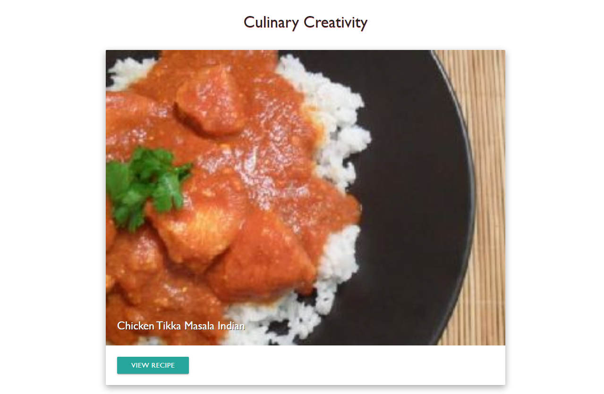
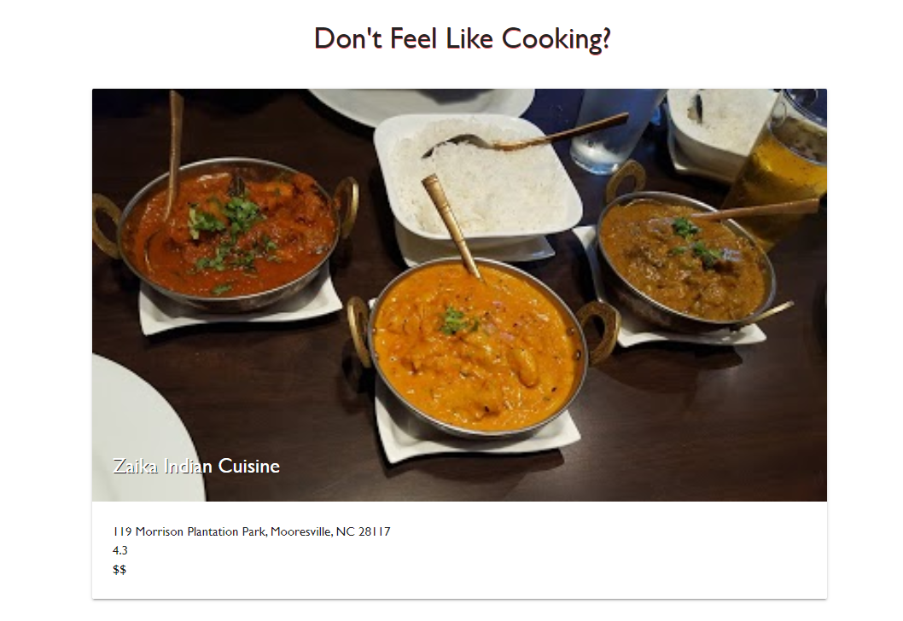

# Whats-for-Dinner
An easy to use application for finding recipes and restaurants based on ingredient and cuisine using Spoonacular API and your Google location using  Places API to dynamically generate recipes based on your ingredient and cuisine search, and your geolocation to populate restaurants in your area.

https://brendonstahl97.github.io/Whats-for-Dinner/

## Technologies Used
  * HTML
  * CSS
  * JavaScript
  * Google Places API
  * Spoonacular API

## Example Photos

## Collaborators
  * https://github.com/brendonstahl97
  * https://github.com/MStuart90
  * https://github.com/kas1330
  * https://github.com/CrawG

## License

Code released under the [MIT](https://github.com/StartBootstrap/startbootstrap-stylish-portfolio/blob/gh-pages/LICENSE) license.
